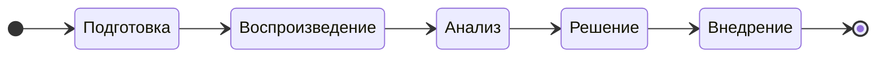

# Постановка задачи на решение проблемы в СУБД PostgreSQL

## Этапы процесса работы над задачей

| №    | Этап | Цель | Действия
| :--- | :--- | :--- | :-------
| 1    | Подготовка | Понять и оформить проблему. | Собрать начальную информацию от пользователя, системы мониторинга, протоколов (логов).
| 2    | Воспроизведение | Подтвердить/опровергнуть существование проблемы. | Повторить проблему в контролируемой среде. Если воспроизвести не удаётся, уточнить условия.
| 3    | Анализ | Найти быстрое временное решение проблемы (если нужно срочно решить проблему). Найти корневую причину проблемы. | Исследование и диагностика. Собрать дополнительную информацию от пользователя, системы мониторинга, протоколов (логов). <ol><li>Поиск шаблонов, аномалий, ошибок, совпадающих по времени.<li>Сужение области поиска: определение проблемного модуля, класса, функции, запроса.<li>Выдвижение гипотез о возможных причинах.<li>Проверка гипотез через дополнительное протоколирование и отладку.<li>Поиск корневой причины, а не симптомов.</ol>
| 4    | Решение | Придумать надёжное, безопасное и эффективное решение.| <ol><li>Оценить риски и последствия. <li>Оценить сложность и трудоёмкость выполнения.</ol>
| 5    | Внедрение | Устранить проблему и убедиться, что она решена. | Разработка, инспекция кода, тестирование, сборка дистрибутивов

## Атрибуты задачи

Атрибуты собраны в группы, порядок следования групп и атрибутов друг за другом имеет значение.

### Общие

<table>
  <tr>
    <th>№</th>
    <th>Атрибуты</th>
    <th>Описание</th>
  </tr>
  <tr>
    <td>1</td>
    <td>Заголовок</td>
    <td>
      Отвечает на вопрос — <ins>какая</ins> имеется проблема и <ins>где</ins>?

Одно предложение, первое слово с прописной буквы, точка в конце не ставится.
Не должно начинаться со слов "исправить ...", "устранить ...", "починить ...", "сломалось ...", "дефект", т.к. это избыточно.

Примеры:
  * Некорректный пересчёт xid64 → xid32 в модуле logical replication
  * Возникновение гонки в планировщике при обновлении global index cache</td>
  </tr>
  <tr>
    <td>2</td>
    <td>Описание</td>
    <td>Общее краткое описание задачи, помогающее понять её суть.

* Что происходит?
* Где происходит?
* Когда происходит?
* При каких условиях происходит?
      
Пишите только факты. Догадки обозначьте явно, что это гипотезы.</td>
  </tr>
  <tr>
    <td>3</td>
    <td>Заказчик</td>
    <td>Название компании, ФИО и должность, от кого пришла задача (2 атрибута)</td>
  </tr>
  <tr>
    <td>4</td>
    <td>Стенд</td>
    <td>Атрибут может оказывать влияние на приоритет задачи

1. $\textcolor{red}{Промышленный}$ 
1. $\textcolor{green}{Тестовый}$
1. $\textcolor{gray}{Неизвестно}$
    </td>

  </tr>
  <tr>
    <td>5</td>
    <td>Продукты</td>
    <td>Список продуктов (прикладного ПО), <ins>где</ins> была обнаружена проблема:
      
* Название и версия продукта
    </td>
  </tr>
  <tr>
    <td>6</td>
    <td>Подсистема / компонент / расширение / функциональность</td>
    <td>Набор тегов. Примеры: replication, security, performance, qfixstat, mchar, global_index</td>
  </tr>
  <tr>
    <td>7</td>
    <td>Серьёзность (Severity)</td>
    <td>Оценить влияние на пользователей и бизнес (масштаб беды и риски).

1. $\textcolor{red}{Блокирующая}$ (Blocker/Critical): Полностью блокирует работу, падение системы, потеря данных.
1. $\textcolor{orange}{Критическая}$ (Critical/Major): Серьёзное нарушение, не работает ключевой функционал, но есть обходные пути.
1. $\textcolor{blue}{Значительная}$ (Major/Medium): Не критичное нарушение, влияет на часть функционала или пользовательский опыт.
1. $\textcolor{magenta}{Незначительная}$ (Minor/Low): Мелкие ошибки, не влияющие на основную работу, но требующие исправления.
1. $\textcolor{green}{Тривиальная}$ (Trivial/Cosmetic): Опечатки, проблемы вёрстки, не влияющие на функциональность.

Для осознанного выбора не должно быть значения по умолчанию!
</td>
  </tr>
  <tr>
    <td>8</td>
    <td>Приоритет (Priority)</td>
    <td>

1. $\textcolor{red}{Высокий}$ (High/P1): Исправить немедленно, в первую очередь, не дожидаясь других задач.
1. $\textcolor{green}{Средний}$ (Medium/P2): Исправить в ближайшее время, когда нет более приоритетных задач.
1. $\textcolor{blue}{Низкий}$ (Low/P3): Исправить по остаточному принципу, когда всё остальное готово.

Для осознанного выбора не должно быть значения по умолчанию!</td>
  </tr>
</table>

### Атрибуты системного сообщения о проблеме (на проблемном узле)

Скопировать из протокола (лога) ОС и/или прикладного ПО, при наличии.\
См. https://postgrespro.ru/docs/postgresql/18/error-message-reporting

> [!IMPORTANT]
> Все системные сообщения должны быть оформлены так, чтобы не потерялись переносы строк, пробелы и любые другие символы.
> Для этого используйте макрос "code" или вложенные файлы.

<table>
  <tr>
    <th>№</th>
    <th>Атрибуты</th>
    <th>Описание</th>
  </tr>
  <tr>
    <td>1</td>
    <td>Дата-время возникновения проблемы</td>
    <td></td>
  </tr>
  <tr>
    <td>2</td>
    <td>Дата-время исчезновения проблемы</td>
    <td></td>
  </tr>
  <tr>
    <td>3</td>
    <td>Фактический результат</td>
    <td>Возможные варианты:

Выполнение процесса прерывается:
1. Фатальная ошибка
2. Падение процесса (segfault)
3. Зависание процесса

Выполнение процесса продолжается:
1. Предупреждение или замечание от системы
2. Некорректное поведение
3. Проблемы с производительностью
4. Проблемы с безопасностью
   </td>
  </tr>
  <tr>
    <td>4</td>
    <td>Ожидаемый результат</td>
    <td></td>
  </tr>
  <tr>
    <td>5</td>
    <td>Общее (краткое) сообщение</td>
    <td></td>
  </tr>
  <tr>
    <td>6</td>
    <td>Детальное (полное) сообщение</td>
    <td>В отличие от общего сообщения содержит данные (контекст)</td>
  </tr>
  <tr>
    <td>7</td>
    <td>Код сообщения</td>
    <td>По коду гораздо легче найти описание и решение проблемы во внешних источниках.
https://postgrespro.ru/docs/postgresql/18/errcodes-appendix
    </td>
  </tr>
  <tr>
    <td>8</td>
    <td>Подсказка (hint)</td>
    <td>Что нужно сделать для решения проблемы</td>
  </tr>
  <tr>
    <td>9</td>
    <td>Текст SQL запроса</td>
    <td>При наличии меток-заменителей `$1`, `$2` и т.д. нужна расшифровка с настоящими значениями, которые использовались при выполнении запроса, т.к. это влияет на план запроса</td>
  </tr>
  <tr>
    <td>10</td>
    <td>План SQL запроса</td>
    <td>Результат команды `EXPLAIN (ANALYZE, BUFFERS)`</td>
  </tr>
  <tr>
    <td>11</td>
    <td>Снимки стека (stack trace)</td>
    <td>Цепочка вызовов функций с параметрами и доп. информацией</td>
  </tr>
  <tr>
    <td>12</td>
    <td>Дампы памяти (heap dumps)</td>
    <td>Приложить файлы в сжатом архиве</td>
  </tr>
</table>
