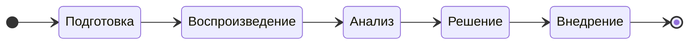

# Постановка задачи на решение проблемы в СУБД PostgreSQL

## Этапы процесса работы над задачей

| №    | Этап | Цель | Действия
| :--- | :--- | :--- | :-------
| 1    | Подготовка | Понять и оформить проблему. | Собрать начальную информацию от пользователя, системы мониторинга, протоколов (логов).
| 2    | Воспроизведение | Подтвердить/опровергнуть существование проблемы. | Повторить проблему в контролируемой среде. Если воспроизвести не удаётся, уточнить условия.
| 3    | Анализ | Найти быстрое временное решение проблемы (если нужно срочно решить проблему). Найти корневую причину проблемы. | Исследование и диагностика. Собрать дополнительную информацию от пользователя, системы мониторинга, протоколов (логов). <ol><li>Поиск шаблонов, аномалий, ошибок, совпадающих по времени.<li>Сужение области поиска: определение проблемного модуля, класса, функции, запроса.<li>Выдвижение гипотез о возможных причинах.<li>Проверка гипотез через дополнительное протоколирование и отладку.<li>Поиск корневой причины, а не симптомов.</ol>
| 4    | Решение | Придумать надёжное, безопасное и эффективное решение.| <ol><li>Оценить риски и последствия. <li>Оценить сложность и трудоёмкость выполнения.</ol>
| 5    | Внедрение | Устранить проблему и убедиться, что она решена. | Разработка, инспекция кода, тестирование, сборка дистрибутивов

## Атрибуты задачи

Атрибуты собраны в группы, порядок следования групп и атрибутов друг за другом имеет значение.

### Общие

<table>
  <tr>
    <th>№</th>
    <th>Атрибуты</th>
    <th>Описание</th>
  </tr>
  <tr>
    <td>1</td>
    <td>Заголовок</td>
    <td>
      Отвечает на вопрос — <ins>какая</ins> имеется проблема и <ins>где</ins>?

Одно предложение, первое слово с прописной буквы, точка в конце не ставится.
Не должно начинаться со слов "исправить ...", "устранить ...", "починить ...", "сломалось ...", "дефект", т.к. это избыточно.

Примеры:
  * Некорректный пересчёт xid64 → xid32 в модуле logical replication
  * Возникновение гонки в планировщике при обновлении global index cache</td>
  </tr>
  <tr>
    <td>2</td>
    <td>Описание</td>
    <td>Общее краткое описание задачи, помогающее понять её суть.

* Что происходит?
* Где происходит?
* Когда происходит?
* При каких условиях происходит?
      
Пишите только факты. Догадки обозначьте явно, что это гипотезы.</td>
  </tr>
  <tr>
    <td>3</td>
    <td>Заказчик</td>
    <td>Название компании, ФИО и должность, от кого пришла задача (2 атрибута)</td>
  </tr>
  <tr>
    <td>4</td>
    <td>Стенд</td>
    <td>Атрибут может оказывать влияние на приоритет задачи

1. $\textcolor{red}{Промышленный}$ 
1. $\textcolor{green}{Тестовый}$
1. $\textcolor{gray}{Неизвестно}$
    </td>

  </tr>
  <tr>
    <td>5</td>
    <td>Продукты</td>
    <td>Список продуктов (прикладного ПО), <ins>где</ins> была обнаружена проблема:
      
* Название и версия продукта
    </td>
  </tr>
  <tr>
    <td>6</td>
    <td>Подсистема / компонент / расширение / функциональность</td>
    <td>Набор тегов. Примеры: replication, security, performance, qfixstat, mchar, global_index</td>
  </tr>
  <tr>
    <td>7</td>
    <td>Серьёзность (Severity)</td>
    <td>Оценить влияние на пользователей и бизнес (масштаб беды и риски).

1. $\textcolor{red}{Блокирующая}$ (Blocker/Critical): Полностью блокирует работу, падение системы, потеря данных.
1. $\textcolor{orange}{Критическая}$ (Critical/Major): Серьёзное нарушение, не работает ключевой функционал, но есть обходные пути.
1. $\textcolor{blue}{Значительная}$ (Major/Medium): Не критичное нарушение, влияет на часть функционала или пользовательский опыт.
1. $\textcolor{magenta}{Незначительная}$ (Minor/Low): Мелкие ошибки, не влияющие на основную работу, но требующие исправления.
1. $\textcolor{green}{Тривиальная}$ (Trivial/Cosmetic): Опечатки, проблемы вёрстки, не влияющие на функциональность.

Для осознанного выбора не должно быть значения по умолчанию!
</td>
  </tr>
  <tr>
    <td>8</td>
    <td>Приоритет (Priority)</td>
    <td>

1. $\textcolor{red}{Высокий}$ (High/P1): Исправить немедленно, в первую очередь, не дожидаясь других задач.
1. $\textcolor{green}{Средний}$ (Medium/P2): Исправить в ближайшее время, когда нет более приоритетных задач.
1. $\textcolor{blue}{Низкий}$ (Low/P3): Исправить по остаточному принципу, когда всё остальное готово.

Для осознанного выбора не должно быть значения по умолчанию!</td>
  </tr>
</table>

### Атрибуты системного сообщения о проблеме (на проблемном узле)

Скопировать из протокола (лога) ОС и/или прикладного ПО, при наличии.\
См. https://postgrespro.ru/docs/postgresql/18/error-message-reporting

> [!IMPORTANT]
> Все системные сообщения должны быть оформлены так, чтобы не потерялись переносы строк, пробелы и любые другие символы.
> Для этого используйте макрос "code" или вложенные файлы.

<table>
  <tr>
    <th>№</th>
    <th>Атрибуты</th>
    <th>Описание</th>
  </tr>
  <tr>
    <td>1</td>
    <td>Дата-время возникновения проблемы</td>
    <td></td>
  </tr>
  <tr>
    <td>2</td>
    <td>Дата-время исчезновения проблемы</td>
    <td></td>
  </tr>
  <tr>
    <td>3</td>
    <td>Фактический результат</td>
    <td>Возможные варианты:

Выполнение процесса прерывается:
1. Фатальная ошибка
2. Падение процесса (segfault)
3. Зависание процесса

Выполнение процесса продолжается:
1. Предупреждение или замечание от системы
2. Некорректное поведение
3. Проблемы с производительностью
4. Проблемы с безопасностью
   </td>
  </tr>
  <tr>
    <td>4</td>
    <td>Ожидаемый результат</td>
    <td></td>
  </tr>
  <tr>
    <td>5</td>
    <td>Общее (краткое) сообщение</td>
    <td></td>
  </tr>
  <tr>
    <td>6</td>
    <td>Детальное (полное) сообщение</td>
    <td>В отличие от общего сообщения содержит данные (контекст)</td>
  </tr>
  <tr>
    <td>7</td>
    <td>Код сообщения</td>
    <td>По коду гораздо легче найти описание и решение проблемы во внешних источниках.
https://postgrespro.ru/docs/postgresql/18/errcodes-appendix
    </td>
  </tr>
  <tr>
    <td>8</td>
    <td>Подсказка (hint)</td>
    <td>Что нужно сделать для решения проблемы</td>
  </tr>
  <tr>
    <td>9</td>
    <td>Текст SQL запроса</td>
    <td>При наличии меток-заменителей `$1`, `$2` и т.д. нужна расшифровка с настоящими значениями, которые использовались при выполнении запроса, т.к. это влияет на план запроса</td>
  </tr>
  <tr>
    <td>10</td>
    <td>План SQL запроса</td>
    <td>Результат команды `EXPLAIN (ANALYZE, BUFFERS)`</td>
  </tr>
  <tr>
    <td>11</td>
    <td>Снимки стека (stack trace)</td>
    <td>Цепочка вызовов функций с параметрами и доп. информацией</td>
  </tr>
  <tr>
    <td>12</td>
    <td>Дампы памяти (heap dumps)</td>
    <td>Приложить файлы в сжатом архиве</td>
  </tr>
</table>

### Текущая информация о СУБД и ОС (на проблемном узле)

Получение информации можно и нужно автоматизировать до запуска одного bash скрипта на стороне клиента!

1. выявить некорректные настройки параметров СУБД под текущие ресурсы ОС
1. дать рекомендации по настройке параметров СУБД

<table>
  <tr>
    <th>№</th>
    <th>Атрибуты</th>
    <th>Описание</th>
  </tr>
  <tr>
    <td>1</td>
    <td>Основная информация о СУБД</td>
    <td>psql: <code>select version(), pg_is_in_recovery() \gx</code></td>
  </tr>
  <tr>
    <td>2</td>
    <td>Дополнительная информация о СУБД</td>
    <td>

1. pg_settings — текущие конфигурационные параметры
2. pg_extensions — список всех расширений с версиями
3. pg_hba_file_rules — текущее содержимое файла конфигурации аутентификации клиентов pg_hba.conf (с инфой о
наличии ошибок)
4. pg_stat_activity — список процессов СУБД
   * узнаём длительность транзакций и запросов, кем заблокировано (см. pg_stat_activity_dump.sh)
   * отдельно посчитать кол-во клиентов с группировкой по статусам: active, idle, idle in transaction
5. pg_replication_slots — список слотов репликации
6. pg_stat_replication — список ведомых серверов
7. pg_stat_statements — различные запросы по потреблению ресурсов
   * длительность выполнения 1-го запроса: `select sum(tital_time) / sum(calls) from pg_stat_statements`. Из `pg_stat_statements` косвенно можно узнать профиль нагрузки — OLTP, OLAP
    </td>
  </tr>
  <tr>
    <td>3</td>
    <td>Информация о ресурсах ОС</td>
    <td>

1. CPU
1. память
1. диски
1. сеть и IP адреса
1. процессы пользователя postgres
1. список прослушиваемых портов для пользователя postgres
    </td>
  </tr>
</table>

### История потребления ресурсов прикладного ПО и ОС (на проблемном узле)

Протоколы и снимки экранов с графиками.\
На графиках временной срез должен включать 3 интервала времени:

1. до возникновения проблемы (помогает понять нагрузку системы в штатном режиме)
1. наличие проблемы (на графиках увидим всплески или провалы)
1. после возникновения проблемы (проблема решилась? когда и как именно?)

<table>
  <tr>
    <th>№</th>
    <th>Атрибуты</th>
    <th>Описание</th>
  </tr>
  <tr>
    <td>1</td>
    <td>Протоколы (логи) работы ОС</td>
    <td>Например, в <code>/var/log/messges</code> смотрим записи от OOM-killer, сетевых дисков</td>
  </tr>
  <tr>
    <td>2</td>
    <td>Протоколы (логи) работы прикладного ПО</td>
    <td>
<code>/var/log/haproxy
/var/log/pgbouncer
/var/log/patroni
/var/log/psql
/var/log/etcd
</code>
    </td>
  </tr>
  <tr>
    <td>3</td>
    <td>Графики потребления ресурсов ОС</td>
    <td>
Взять из системы мониторинга. В процентах и абсолютные значения.
        
1. утилизация CPU
1. утилизация памяти
1. утилизация дисков
1. свободное место
1. нагрузка на сеть
    </td>
  </tr>
  <tr>
    <td>4</td>
    <td>Графики потребления ресурсов СУБД</td>
    <td>
Взять из системы мониторинга. В процентах и абсолютные значения.

1. График с кол-вом подключений к СУБД
   * отдельно по статусам: active, idle, idle in transaction
2. График с кол-вом успешных запросов (TPS, QPS) и ошибок в СУБД
   * TPS, QPS — pg_stat_database, pg_stat_statements
   * TPS = sum(commits + rollbacks)
   * QPS = sum(calls)
   * Кол-во ошибок = select sum(xact_rollback) from pg_stat_database
    </td>
  </tr>
</table>

### Архитектура

СУБД может состоять из набора взаимосвязанных узлов и прикладного ПО, образуя отказоустойчивый кластер высокой доступности (HA/DR).
Запрос от приложения до СУБД может пройти по цепочке через несколько узлов и систем.
Например: `HAProxy → PgBouncer → PostgreSQL`.
Проблема может быть на любом звене, поэтому нужна архитектура.
Можно запросить у клиента графическую архитектурную схему HA/DR кластера СУБД.
На схеме должно быть видно размещение ПО по серверам, указаны их IP адреса, указаны порты взаимодействия (пример).

<table>
  <tr>
    <th>№</th>
    <th>Атрибуты</th>
    <th>Описание</th>
  </tr>
  <tr>
    <td>1</td>
    <td>Архитектурные компоненты ОС и их версии</td>
    <td>Указать, что используется, версии

1. Виртуализация
1. Название ОС, ядро ОС
1. Контейнеризация
1. Библиотеки (только если это важно)
   </td>
  </tr>
  <tr>
    <td>2</td>
    <td>Архитектурные компоненты прикладного ПО</td>
    <td>Указать, что используется, версии

1. Virtual IP manager (KeepAlived)
2. Прокси-сервер (HAProxy)
3. Пулер соединений (PgBouncer)
4. СУБД (PostgreSQL)
   * Расширения СУБД (если это важно), см. `pg_available_extension` и `pg_available_extension_versions`
5. Отказоустойчивость (Patroni)
6. Distributed Configuration Store (Etcd)
   </td>
  </tr>
  <tr>
    <td>3</td>
    <td>Конфигурационные файлы прикладного ПО</td>
    <td>patroni.yml, postgresql.conf, ... Должны быть одинаковыми на каждом узле. Если отличаются, то прислать все варианты.</td>
  </tr>
  <tr>
    <td>4</td>
    <td>Состояние работы прикладного ПО на каждом узле</td>
    <td>Чтобы понять корректность настройки и работы

1. KeepAlived
1. HAProxy (откуда и куда перенаправляется трафик)
1. PgBouncer
1. cостояние кластера Patroni
1. cостояние кластера Etcd
    </td>
  </tr>
</table>

### Воспроизведение

<table>
  <tr>
    <th>№</th>
    <th>Атрибуты</th>
    <th>Описание</th>
  </tr>
  <tr>
    <td>1</td>
    <td>Пошаговый сценарий воспроизведения</td>
    <td>

* Как воспроизвести проблему?
* Где и какие действия выполнялись?

Самая лучшая демонстрация ошибки — последовательность шагов в формате "команда — вывод".

Проблема должна воспроизводиться на чистой (новой) инсталляции ОС и СУБД!

**Для проблем при выполнении команд в ОС нужно**
1. скопировать все команды ОС и весь вывод из терминала в файл `problem_scenario.out`

**Для проблем с СУБД нужны**

Предпочтительный вариант:
1. Файл с дистрибутивом СУБД (`rpm`, `deb`, `zip`, `tar.gz`)
2. Файл-архив с резервной копией СУБД, сделанной утилитой pg_basebackup или просто сжатый архив папки PGDATA, сделанный на остановленной (!) СУБД.
Удалите из СУБД все лишние БД, схемы, таблицы, типы, функции, секреты и персональные данные клиентов!
3. Файл `problem_scenario.sql`, который можно передать программе psql (другие программы не подходят!) и
увидеть проблему.

Альтернативный вариант:
1. Все конфигурационные файлы: `*.conf` из папки `PGDATA`
2. Файл `problem_scenario.sql`, который можно передать программе psql (другие программы не подходят!) и увидеть проблему.

**Для проблем в GUI нужны**
1. последовательность снимков экранов, дополненных описанием совершённых действий

https://postgrespro.ru/docs/postgresql/18/bug-reporting
    </td>
  </tr>
  <tr>
    <td>2</td>
    <td>Наличие проблемы</td>
    <td>Возможные варианты:

1. $\textcolor{red}{Проблема\ воспроизводится}$
1. $\textcolor{orange}{Проблема\ не\ воспроизводится}$
1. $\textcolor{green}{Реакция\ системы\ является\ ожидаемым\ поведением}$
    </td>
  </tr>
</table>  
