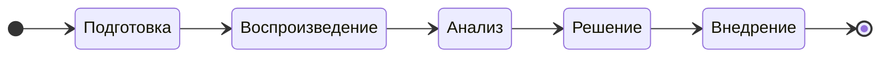

# Постановка задачи на решение проблемы в СУБД

## Этапы процесса работы над задачей

| №    | Этап | Цель | Действия
| :--- | :--- | :--- | :-------
| 1    | Подготовка | Понять и оформить проблему. | Собрать начальную информацию от пользователя, системы мониторинга, протоколов (логов).
| 2    | Воспроизведение | Подтвердить/опровергнуть существование проблемы. | Повторить проблему в контролируемой среде. Если воспроизвести не удаётся, уточнить условия.
| 3    | Анализ | Найти быстрое временное решение проблемы (если нужно срочно решить проблему). Найти корневую причину проблемы. | Исследование и диагностика. Собрать дополнительную информацию от пользователя, системы мониторинга, протоколов (логов). <ol><li>Поиск шаблонов, аномалий, ошибок, совпадающих по времени.<li>Сужение области поиска: определение проблемного модуля, класса, функции, запроса.<li>Выдвижение гипотез о возможных причинах.<li>Проверка гипотез через дополнительное протоколирование и отладку.<li>Поиск корневой причины, а не симптомов.</ol>
| 4    | Решение | Придумать надёжное, безопасное и эффективное решение.| <ol><li>Оценить риски и последствия. <li>Оценить сложность и трудоёмкость выполнения.</ol>
| 5    | Внедрение | Устранить проблему и убедиться, что она решена. | Разработка, инспекция кода, тестирование, сборка дистрибутивов

## Атрибуты задачи

Атрибуты собраны в группы, порядок следования групп и атрибутов друг за другом имеет значение.

### Общие 

<table>
  <tr>
    <th>Атрибуты</th>
    <th>Описание</th>
  </tr>
  <tr>
    <td>Заголовок</td>
    <td>
      Отвечает на вопрос — <ins>какая</ins> имеется проблема и <ins>где</ins>?

Одно предложение, первое слово с прописной буквы, точка в конце не ставится.
Не должно начинаться со слов "исправить ...", "устранить ...", "починить ...", "сломалось ...", "дефект", т.к. это избыточно.

Примеры:
  * Некорректный пересчёт xid64 → xid32 в модуле logical replication
  * Возникновение гонки в планировщике при обновлении global index cache</td>
  </tr>
  <tr>
    <td>Описание</td>
    <td>Общее краткое описание задачи, помогающее понять её суть.

* Что происходит?
* Где происходит?
* Когда происходит?
* При каких условиях происходит?
      
Пишите только факты. Догадки обозначьте явно, что это гипотезы.</td>
  </tr>
  <tr>
    <td>Заказчик</td>
    <td>Название компании, ФИО и должность, от кого пришла задача (2 атрибута)</td>
  </tr>
  <tr>
    <td>Стенд</td>
    <td>Атрибут может оказывать влияние на приоритет задачи

1. $\textcolor{red}{Промышленный}$ 
1. $\textcolor{green}{Тестовый}$
1. $\textcolor{gray}{Неизвестно}$
    </td>

  </tr>
  <tr>
    <td>Продукты</td>
    <td>Список продуктов (прикладного ПО), <ins>где</ins> была обнаружена проблема:
      
* Название и версия продукта
    </td>
  </tr>
  <tr>
    <td></td>
    <td></td>
  </tr>
</table>
