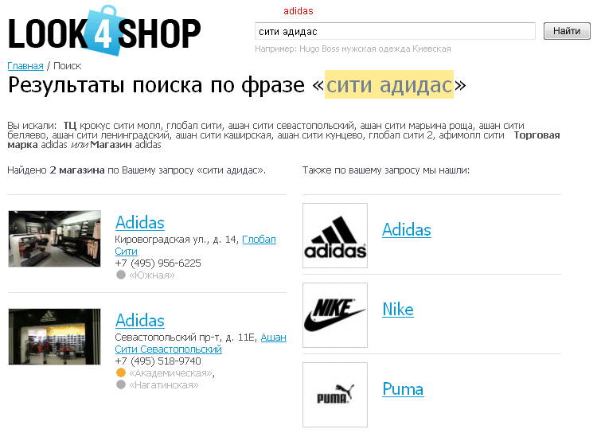
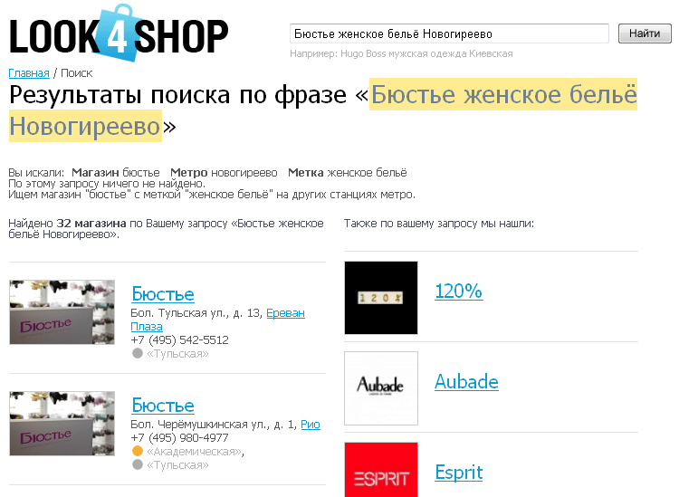

  
>Личный опыт Мухтарова Рината на предыдущих местах работы. Веб-сайты, в разработке которых я принимал участие, были публичными. Поэтому я делюсь несколькими снимками экранов.

Look4shop (2011)
================

Look4shop – навигатор покупок по магазинам и ТЦ, в настоящее время проект закрыт.  
В рамках этого проекта был сделан интеллектуальный поисковый механизм.

1\. Результат поиска по запросу «Hugo Boss мужская одежда Киевская».  
Для выполнения поиска производится семантический анализ и определение сущностей.  
При сортировке по релевантности учитывается «важность» каждой сущности.   
Так, на первых двух позициях показаны фирменные магазины Hugo Boss, а на третьей – «Микродин»,   
который тоже продаёт товары этой торговой марки.

2\. Ошибки в поисковом запросе исправляются автоматически (см. название ТЦ)

3\. Возможен неполный ввод названий сущностей (см. название станции метро)

4\. Поисковый алгоритм справляется с неоднозначными и неполными запросами.  
Возможен ввод названий латинскими или русскими буквами, транслитерация делается автоматически.

5\. Если по исходному запросу ничего не найдено, производится автоматическое упрощение исходного запроса и новый поиск.   
Причём отбрасывается наименее важная сущность по смыслу (см. станцию метро).

6\. Исправление клавиатурной опечатки и транслитерация, упрощение исходного запроса и новый поиск.

Autorif (2009)
==============

Продажа запчастей и автосервис для ведущих марок японских автомобилей.

Полнотекстово-параметрический поиск по форуму.
